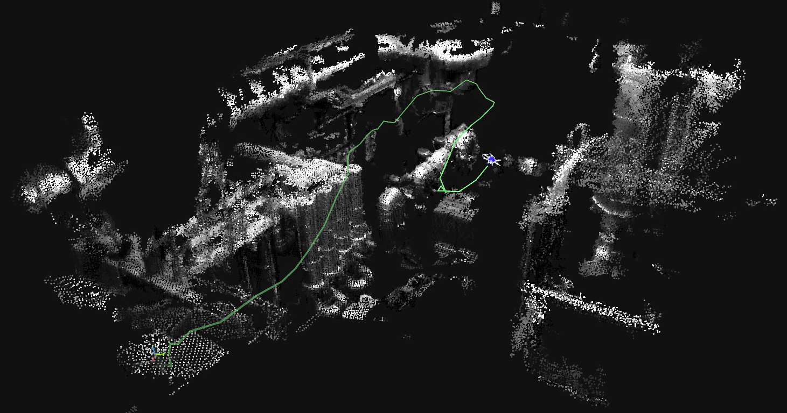
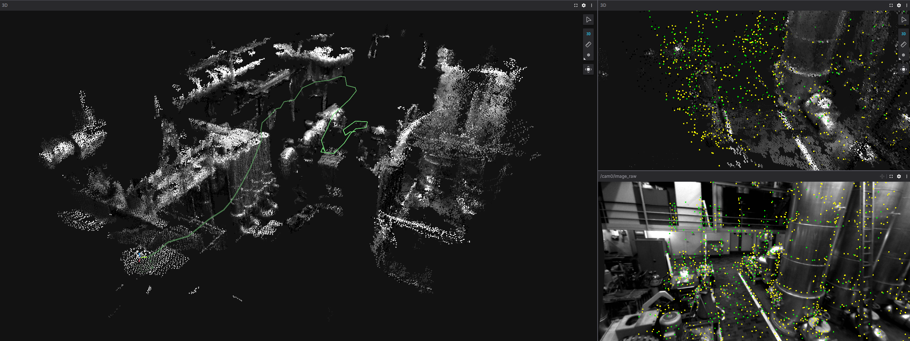
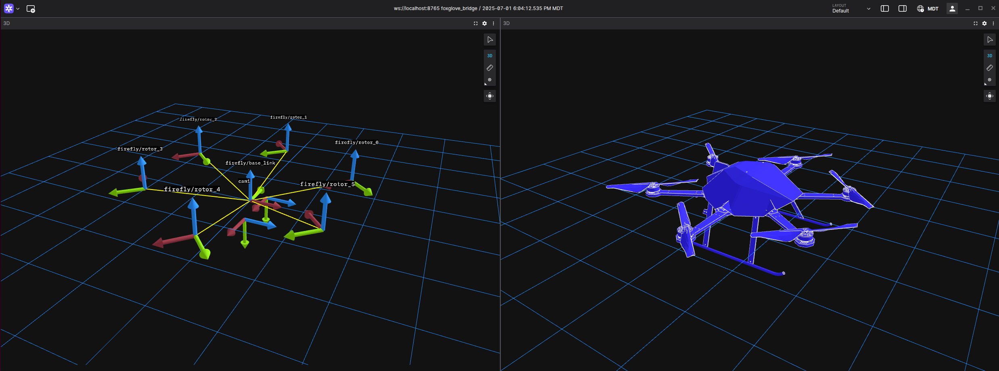

# Visualizing SLAM using Foxglove
Foxglove is a data visualization app that uses the universal [MCAP](https://mcap.dev/) data format to streamline multimodal robotics workflows. Simultaneous localization and mapping (SLAM) is an excellent example of multimodal data fusion that combines videos from calibrated cameras and acceleration data from an inertial measurement unit (IMU) to map out the environment and determine where the robot is located through time.

In this tutorial, we will demonstrate how to convert the [EuRoC MAV](https://projects.asl.ethz.ch/datasets/doku.php?id=kmavvisualinertialdatasets) dataset into MCAP format and visualize it using Foxglove.



<!-- omit in toc -->
## Table of Contents
- [Visualizing SLAM using Foxglove](#visualizing-slam-using-foxglove)
    - [Step 1: Install Dependencies](#step-1-install-dependencies)
    - [Step 2: Convert to MCAP](#step-2-convert-to-mcap)
        - [Option 1: Your SLAM dataset is a directory of files.](#option-1-your-slam-dataset-is-a-directory-of-files)
        - [Option 2: Your SLAM dataset is a ROS bag.](#option-2-your-slam-dataset-is-a-ros-bag)
    - [Step 3: Visualize the Data](#step-3-visualize-the-data)
- [Deep Dive: Converting Multimodal Data to MCAP using Foxglove SDK](#deep-dive-converting-multimodal-data-to-mcap-using-foxglove-sdk)
    - [Defining Message Schemas](#defining-message-schemas)
    - [The Image Message](#the-image-message)
    - [The IMU Message](#the-imu-message)
- [Where is the Drone? Enhance your Visualization with a URDF](#where-is-the-drone-enhance-your-visualization-with-a-urdf)
    - [The Drone URDF](#the-drone-urdf)
    - [The Launch File](#the-launch-file)
    - [The Joint State Publisher](#the-joint-state-publisher)
- [Visualize the Data](#visualize-the-data)


## Step 1: Install Dependencies
A working ROS 2 installation is needed for this tutorial. We tested this pipeline using ROS 2 Humble with an Ubuntu 22.04 system. Run the following commands in a new terminal to get the SLAM and Foxglove dependencies:
```bash
sudo apt install \
    ros-$ROS_DISTRO-foxglove-bridge \
    ros-$ROS_DISTRO-imu-tools \
    ros-$ROS_DISTRO-rtabmap-ros \
    ros-$ROS_DISTRO-rosbag2-storage-mcap \
    ros-$ROS_DISTRO-image-proc
```

## Step 2: Convert to MCAP
The EuRocC MAV dataset standardized how SLAM data is collected. The EuRoC dataset contains IMU data represented as a .csv and an IMU configuration file, as well as side-by-side camera videos represented as timestamped images and camera configuration files.

``` 
imu0
├── data.csv
└── sensor.yaml
cam<camera_number>
├── data
│   ├── <timestamp>.png
│   └── ...
├── data.csv
└── sensor.yaml
...
```
Notice that there is no pointcloud or position estimates included in the original dataset. Luckily, Foxglove can be used to visualize data in real time using the [Foxglove SDK](https://foxglove.dev/blog/announcing-the-foxglove-sdk) for direct streaming or [Foxglove bridge](https://docs.foxglove.dev/docs/connecting-to-data/ros-foxglove-bridge) for visualizing ROS 1 or ROS 2 topics. In this tutorial, we will show how to use **both tools** in a ROS 2 workflow using the popular real-time SLAM package [RTAB-Map](https://introlab.github.io/rtabmap/).

We will use the Foxglove SDK to convert the EuRoC dataset to an MCAP with the following topics to interact with RTAB-Map,
```
/cam0/image_raw -> sensor_msgs/msg/Image
/cam1/image_raw -> sensor_msgs/msg/Image
/imu0 -> sensor_msgs/msg/Imu
```
then record a new MCAP with pointcloud data and a visualization of our robot. MCAP is the default storage format for ROS 2 (Iron) and newer due to its optimized recording and ability to integrate with third-party tools outside ROS environments, making it the ideal format to work with SLAM data. If using a different SLAM dataset that is in ROS 1 .bag format or ROS 2 .db3 format, conversion to MCAP becomes trivial using the [MCAP command line interface (CLI)](https://mcap.dev/guides/cli).
#### Option 1: Your SLAM dataset is a directory of files.
Clone the </span>[code repository](https://github.com/foxglove/tutorials/tree/main/datasets/EuRoC_MAV) for this tutorial. In a new python virtual environment, install the following dependencies:
```bash
pip install foxglove-sdk numpy opencv-python pyyaml
```
Next, run our custom conversion script designed for the EuRoC dataset using the Foxglove SDK. We will break down how this script works in the [Deep Dive: Converting Multimodal Data to MCAP using Foxglove SDK](#deep-dive-converting-multimodal-data-to-mcap-using-foxglove-sdk) section of this tutorial so you can create your own conversion scripts.
```bash
python3 convert-euroc-2-mcap.py --src <data/path> --dst <output/path>.mcap
```

#### Option 2: Your SLAM dataset is a ROS bag.
The [MCAP CLI](https://mcap.dev/guides/cli) comes with commands to quickly convert bag files to MCAP! `mcap convert <ros_bag/path> <mcap/path>` can be used as long as the message definitions contain the information that RTAB-Map is expecting. It may be beneficial to convert ROS 1 bags to ROS 2 bag format first before converting to MCAP to improve compatibility. Foxglove's built-in [debugging panels](https://docs.foxglove.dev/docs/visualization/panels/raw-messages) are a quick way to verify topic contents match.

## Step 3: Visualize the Data
Just like that, we are ready to perform SLAM and visualize the data! Open four new terminals. In the first terminal, start the Foxglove bridge:
```bash
ros2 run foxglove_bridge foxglove_bridge
```
In the second terminal, start an RTAB-Map instance with settings preset for EuRoC MAV datasets:
```bash
ros2 launch rtabmap_examples euroc_datasets.launch.py gt:=false
# Note: This example script accounts for camera and IMU calibrations and transformations. 
# More calibration information is needed for other SLAM datasets.
```

In the third terminal, play back the MCAP file we made:
```bash
ros2 bag play <path/to/mcap> --clock
``` 
In the last terminal, record the resulting transformations and point clouds in a new MCAP file that can be visualized at a later time.
```bash
ros2 bag record -s mcap --all
```
Finally, either watch the drone perform SLAM live by connecting to the [Foxglove Websocket](https://app.foxglove.dev) in your browser or import the new MCAP directly to Foxglove!



# Deep Dive: Converting Multimodal Data to MCAP using Foxglove SDK
In this section, we will explore how the Foxglove SDK was used to create a custom MCAP conversion script that is compatible with ROS 2 listeners. Please refer to the [full script](https://github.com/foxglove/tutorials/tree/main/datasets/EuRoC_MAV/convert-euroc-2-mcap.py) script while following along.

### Defining Message Schemas 
We start by creating a new MCAP writer that will create an MCAP file for us to write to:
```python
writer = foxglove.open_mcap(out_mcap_path, allow_overwrite=True) # Open the mcap file for writing
```

In this tutorial, we will define our schemas to match the ROS 2 `sensor_msgs/msg/Image` and `sensor_msgs/msg/Imu` messages that RTAB-Map is expecting.

```python
# Direct foxglove to our message definitions
imu_msg_path = Path("msgs/imu_flat.msg")
img_msg_path = Path("msgs/image_flat.msg")

# Define our custom ROS 2 schemas
img_schema = Schema(
    name="sensor_msgs/msg/Image",
    encoding="ros2msg",
    data=img_msg_path.read_bytes(),
)
imu_schema = Schema(
    name="sensor_msgs/msg/Imu",
    encoding="ros2msg",
    data=imu_msg_path.read_bytes(),
)
```

The Foxglove SDK requires that ROS 2 messages be formatted in a delimited, concatenated format. This format is nearly captured using built-in ROS 2 tools such as `ros2 interface show sensor_msgs/msg/Image --no-comments`. More information about schema formatting is available [here](https://mcap.dev/spec/registry). For convenience, the `msgs` folder contains the formatted messages for the `sensor_msgs/msg/Image` and `sensor_msgs/msg/Imu` messages.

Next, we make separate channels for each of the message schemas for convenient logging:
```python
# ros2msg channels require cdr encoding type
cam0_channel = Channel(topic="/cam0/image_raw", schema=img_schema, message_encoding="cdr")
cam1_channel = Channel(topic="/cam1/image_raw", schema=img_schema, message_encoding="cdr")
imu_channel = Channel(topic="/imu0", schema=imu_schema, message_encoding="cdr")
```
### The Image Message
We start by looping through each image with `getImageMsg`, which takes in a timestamp and image and outputs an object of type `Image`
```python
def read_images(cam_directory, channel, cam_num):
    # Loop through the data.csv file and read in the image files
    with open(cam_directory + "/data.csv", "r") as csv_file:
 reader = csv.reader(csv_file)
        next(reader)  # Skip the first row with headers
        for row in reader:
 timestamp = int(row[0])
 image_name = row[1]
 image_path = os.path.join(cam_directory, "data", image_name)
            if not os.path.exists(image_path):
                print(f"Image {image_path} does not exist")
                continue

            # Convert image to ROS2 message and write to channel
 image_msg = getImageMsg(image_path, timestamp, cam_num)
 channel.log(serialize_message(image_msg), log_time=timestamp)
```
The EuRoC dataset is composed of stereo images. For RGB images, the parameters of the `getImageMsg` function should be adjusted appropriately. 
```python
def getImageMsg(img_path: str, timestamp: int, cam_num: int) -> Image:
    # Load as grayscale image data
 img = cv2.imread(img_path, cv2.IMREAD_GRAYSCALE)
    if img is None:
        raise ValueError(f"Could not load image: {img_path}")
    
 height, width = img.shape
    
 sec = int(timestamp // 1e9)
 nsec = int(timestamp % 1e9)

    # Fill in the image message data
 ros_image = Image()
 ros_image.header = Header()
 ros_image.header.stamp.sec = sec
 ros_image.header.stamp.nanosec = nsec
 ros_image.header.frame_id = "cam"+str(cam_num)
 ros_image.height = height
 ros_image.width = width
 ros_image.encoding = "mono8" #Stereo images
 ros_image.step = width  # For mono8, 1 byte per pixel
 ros_image.data = img.tobytes()

    return ros_image
```

### The IMU Message
The IMU data is saved in the data.csv file under the following format:
- Timestamp [ns],
- Angular velocity [rad s^-1] (x,y,z),
- Linear acceleration [rad s^-1] (x,y,z)

The `sensor_msgs/msgs/Imu` message has the format of:
  - header (header)
  - orientation (quaternion)
  - orientation covariance (float32[9])
  - angular velocity (vector3)
  - angular velocity covariance (float32[9])
  - linear acceleration (vector3)
  - linear acceleration covariance (float32[9])

Notice that the orientation, orientation covariance, angular velocity covariance, and linear acceleration covariance are not present in the data for each timestamp. This is where the `gyroscope_noise_density` and `accelerometer_noise_density` parameters come into play in the `sensor.yaml` file. We can assume the diagonal of the covariance matrix to be a function of the IMU noise densities and sample rate.

```python
def read_imu(imu_data_path, imu_channel, imu_yaml_path):
    # Get the IMU config with covariance information
    with open(imu_yaml_path, "r") as imu_yaml_file:
 imu_yaml = yaml.load(imu_yaml_file, Loader=yaml.FullLoader)

    # Get the noise and bias parameters, see https://github.com/ethz-asl/kalibr/wiki/IMU-Noise-Model for more details
 sample_sqr_dt = np.sqrt(1.0/float(imu_yaml["rate_hz"]))
 sigma_gd = imu_yaml["gyroscope_noise_density"]*sample_sqr_dt
 sigma_ad = imu_yaml["accelerometer_noise_density"]*sample_sqr_dt

    # Calculate the covariance matrices
 angular_velocity_cov = np.diag([sigma_gd**2, sigma_gd**2, sigma_gd**2]).astype(np.float64)
 linear_acceleration_cov = np.diag([sigma_ad**2, sigma_ad**2, sigma_ad**2]).astype(np.float64)
```
We can now formulate the IMU ROS 2 message. Orientation is not measured by the IMU for this application, so we will leave its covariance empty.
```python

    with open(imu_data_path, "r") as imu_file:
 reader = csv.reader(imu_file)
        next(reader)  # Skip the first row with headers
        for row in reader:
 timestamp = int(row[0])
 angular_velocity = [float(row[1]), float(row[2]), float(row[3])]
 linear_acceleration = [float(row[4]), float(row[5]), float(row[6])]

 imu_msg = Imu()
 imu_msg.header = Header()
 imu_msg.header.stamp.sec = timestamp // int(1e9)
 imu_msg.header.stamp.nanosec = timestamp % int(1e9)
 imu_msg.header.frame_id = "imu4" # Transformation reference frame
            # Orientation
 imu_msg.orientation = Quaternion()
 imu_msg.orientation.x = 0.0
 imu_msg.orientation.y = 0.0
 imu_msg.orientation.z = 0.0
 imu_msg.orientation.w = 1.0
 orientation_cov = np.zeros((3,3), dtype=np.float64)
 imu_msg.orientation_covariance = list(orientation_cov.flatten(order="C").astype(float))
            # Angular velocity
 imu_msg.angular_velocity = Vector3()
 imu_msg.angular_velocity.x = angular_velocity[0]
 imu_msg.angular_velocity.y = angular_velocity[1]
 imu_msg.angular_velocity.z = angular_velocity[2]
 imu_msg.angular_velocity_covariance = list(angular_velocity_cov.flatten(order="C").astype(float))
            # Linear acceleration
 imu_msg.linear_acceleration = Vector3()
 imu_msg.linear_acceleration.x = linear_acceleration[0]
 imu_msg.linear_acceleration.y = linear_acceleration[1]
 imu_msg.linear_acceleration.z = linear_acceleration[2]
 imu_msg.linear_acceleration_covariance = list(linear_acceleration_cov.flatten(order="C").astype(float))

 imu_channel.log(serialize_message(imu_msg), log_time=timestamp)
```
Now you know how to make custom schemas with the Foxglove SDK that can interface with ROS. The Foxglove SDK is not limited only to `Image` and `Imu` message types; in fact, there is a [wide selection of supported schemas](https://docs.foxglove.dev/docs/visualization/message-schemas) for every type of project.

# Where is the Drone? Enhance your Visualization with a URDF
Adding a visualization of the drone is optional; however, adding one can lead to insights about correct transformations between the drone, cameras, and IMU. Since SLAM runs in real time, we will make a new [robot_state_publisher](https://docs.ros.org/en/humble/Tutorials/Intermediate/URDF/Using-URDF-with-Robot-State-Publisher-py.html) ROS 2 node that listens to RTAB-Map and dynamically updates the drone's pose. Please refer to [the LAFAN1 tutorial](https://foxglove.dev/blog/converting-the-lafan1-retargeting-dataset-to-mcap) to learn how to apply a URDF to an MCAP dataset in post-processing.

### The Drone URDF
First, we will make a new ROS2 package to bundle our SLAM, robot_state_publisher, joint_state_publisher, and Foxglove bridge into one executable. 
```bash
cd ros2_ws/src
ros2 pkg create --build-type ament_python --license Apache-2.0 euroc_slam
```

The EuRoC dataset was recorded on an Asctec Firefly drone, and its URDF model is included in the open-source [RotorS](https://github.com/ethz-asl/rotors_simulator) project for ROS 1. The exact URDF files and meshes for the Firefly can be downloaded [here](https://github.com/foxglove/tutorials/tree/main/datasets/EuRoC_MAV/ros2/src/euroc_slam).



### The Launch File

Navigate to the package directory and make a new launch file. Don't forget to [configure](https://docs.ros.org/en/humble/Tutorials/Intermediate/Launch/Launch-Main.html) `setup.py` to recognize launch, mesh, and urdf files!

```bash
cd euroc_slam
mkdir launch
touch launch/firefly.launch.py
```
Launch files are concise ways to bundle multiple ROS nodes together. `ros2 run foxglove_bridge foxglove_bridge` is equivalently represented in a launch file as:
```python
foxglove_bridge_node = Node(
    package='foxglove_bridge',
    executable='foxglove_bridge',
    name='foxglove_bridge',
    output='screen',
)
```
In this script, we enable the following nodes:

1. The Foxglove bridge to visualize ROS 2 topics.
2. The `robot_state_publisher` that publishes the URDF transformations and meshes.
3. A static transformation connecting the drone to the SLAM localization output.
4. A joint state publisher that simulates the rotors in motion. This step is purely for visual effect, as the motor torques are not included in the dataset's scope.
5. RTABMAP to perform SLAM in real time as our dataset is replayed.

```python
from launch import LaunchDescription
from launch.actions import DeclareLaunchArgument, IncludeLaunchDescription, TimerAction
from launch.launch_description_sources import PythonLaunchDescriptionSource
from launch.substitutions import Command, LaunchConfiguration, PathJoinSubstitution
from launch_ros.actions import Node
from launch_ros.substitutions import FindPackageShare
from launch_ros.parameter_descriptions import ParameterValue


def generate_launch_description():
 use_sim_time = LaunchConfiguration('use_sim_time', default='false')
    
    # Generate URDF from xacro file (or read URDF file)
 urdf_file = PathJoinSubstitution([FindPackageShare('rotors_description'), 'urdf', 'firefly.xacro'])
 robot_description = ParameterValue(Command(['xacro ', urdf_file, ' namespace:=firefly']), value_type=str)

    # Create nodes
 foxglove_bridge_node = Node(
        package='foxglove_bridge',
        executable='foxglove_bridge',
        name='foxglove_bridge',
        output='screen',
 )

 robot_state_publisher_node = Node(
        package='robot_state_publisher',
        executable='robot_state_publisher',
        name='robot_state_publisher',
        output='screen',
        parameters=[{'use_sim_time': use_sim_time, 'robot_description': robot_description}]
 )

 static_transform_publisher_node = Node(
        package='tf2_ros',
        executable='static_transform_publisher',
        name='static_transform_publisher',
        output='screen',
        arguments=['0', '0', '0', '0', '0', '0', 'base_link', 'firefly/base_link']
 )

 firefly_state_publisher_node = Node(
       package='rotors_description',
       executable='firefly_state_publisher',
       name='firefly_state_publisher',
       output='screen'
 )

 rtabmap_include = IncludeLaunchDescription(
 PythonLaunchDescriptionSource([
 FindPackageShare('rtabmap_examples'),
            '/launch/euroc_datasets.launch.py'
 ]),
        launch_arguments={
            'gt': 'false'
 }.items()
 )

    return LaunchDescription([
 DeclareLaunchArgument(
            'use_sim_time',
            default_value='false',
            description='Use simulation (Gazebo) clock if true'),
 foxglove_bridge_node,
 TimerAction(period=2.0, actions=[robot_state_publisher_node]),  # 2 second delay
 TimerAction(period=4.0, actions=[static_transform_publisher_node]),  # 4 second delay
 TimerAction(period=6.0, actions=[rtabmap_include]), 
        # TimerAction(period=10.0, actions=[firefly_state_publisher_node]) 
 ])
```
### The Joint State Publisher
The `firefly_state_publisher` is used to spin the rotors at a constant velocity during flight, defined by:
```python
self.increment = (360.0*self.spin_rate)/loop_rate
self.angle = ((self.angle + self.increment) % 360.0) - 180.0
self.joint_state.position = [self.angle, -self.angle, self.angle, -self.angle, self.angle, -self.angle]
```
This is purely visual and can be defined based on specific motor torque values, should they be available.

## Visualize the Data
Open three terminals. In the first terminal, initialize the launch node containing RTAB-Map, the Foxglove bridge, and the URDF with:
```bash
ros2 launch euroc_slam firefly.launch.py
# Note: Don't forget to build and source your ROS environment after making changes!
```
In the second terminal, play back the MCAP file we made:
```bash
ros2 bag play <path/to/mcap> --clock
``` 
In the last terminal, record the resulting transformations, point clouds, and URDF in a new MCAP file that can be visualized at a later time.
```bash
ros2 bag record -s mcap --all
```
Open Foxglove and watch SLAM happen live, or load the generated MCAP file!


[Get started with Foxglove](https://app.foxglove.dev/human-interaction-and-robotics-lab/dashboard) and MCAP today! If you have any questions or need support, [join our community](https://discord.com/invite/vUVAdFmMFM)—we’d love to hear from you and help you succeed.
