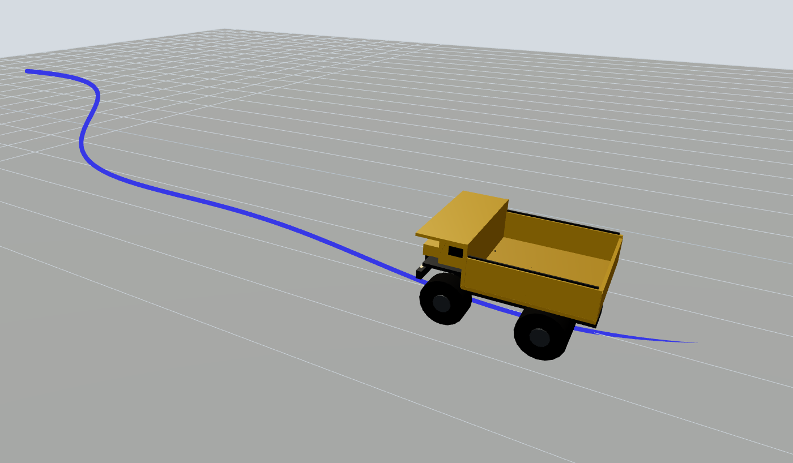
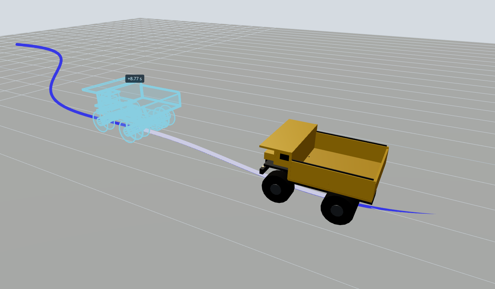

# Model Ghost Preview extension

While you hover the playback bar, this panel keeps the model at the current time and draws a second copy — by default a light-blue wireframe — at the hovered time. A path through every pose shows where the ghost sits along the trajectory.





The ghost only appears when preview is enabled, a preview time is set, and that pose is different from the current one. Hovering the path inside the panel also sets the preview time (so Map and Plot can follow it); clicking the path seeks playback.

## Why a custom panel

VIZ-3444 asks for this on the built-in 3D panel, the way the Map panel already previews GNSS while you skim the timeline. A message converter cannot do it: converters run when a new input message arrives, and global variables do not reprocess the current frame. While playback is paused, nothing arrives, so the ghost cannot move with the hover. Built-in 3D panel internals are not extensible either. This extension is a working prototype of the interaction — its own three.js scene — until the 3D panel supports preview natively.

## Install

From `extensions/model_ghost_preview/extension`:

```sh
npm ci && npm run local-install
```

That installs the extension into Foxglove desktop. Refresh the app (`Ctrl-R`) and add a **Model Ghost Preview** panel.

To share a build instead, package it and drag the `.foxe` into Foxglove:

```sh
npm run package
```

## Demo data

```sh
cd extensions/model_ghost_preview/demo
pip install -r requirements.txt
python generate_demo_mcap.py --output demo.mcap
```

The file is about 60 seconds at 20 Hz. A truck drives a winding haul road a few hundred meters long.

| Topic | Schema | What it is |
| --- | --- | --- |
| `/truck/pose` | `foxglove.PoseInFrame` | Pose in the `map` frame. This is the ghost panel input. |
| `/tf` | `foxglove.FrameTransforms` | `map` → `truck`, so the built-in 3D panel can follow the same motion. |
| `/scene/road` | `foxglove.SceneUpdate` | Road ribbon, center line, and a few berms, published once. |

Open the MCAP in Foxglove, then import [`foxglove_layouts/model_ghost_preview.json`](foxglove_layouts/model_ghost_preview.json) from the layout menu. The layout places this panel next to a 3D panel and a Raw Messages panel on `/truck/pose`. If a panel shows up as unknown after import, add **Model Ghost Preview** from the panel list and pick the pose topic (or add the panel yourself, then export a layout).

Poses are drawn in the topic's own frame. That frame is the panel's fixed world frame — there is no TF tree. The message **receive time** (log time) is the timeline key, because that is what the playback bar and `currentTime` use.

## Settings

| Group | Setting | Notes |
| --- | --- | --- |
| General | Pose topic | Supported schemas only. |
| General | Child frame | Shown for TF-like schemas. Empty locks onto the first `child_frame_id` seen in the range; the field suggests frames observed on the topic. |
| General | Interpolation | `interpolate` (lerp position, slerp rotation) or `previous`. |
| Model | Source | Procedural haul truck, or a `.glb` / `.gltf` URL. |
| Model | Scale, yaw, pitch, roll | Degrees, Euler ZYX. |
| Model | Truck color | Body color of the procedural truck. |
| Preview | Visibility | The Preview ON / OFF toggle. |
| Preview | Style | `wireframe` (default), `transparent`, or `solid`. |
| Preview | Color, opacity | Wireframe uses an edge overlay plus a faint fill. |
| Preview | Time label | `+Δt s` relative to the current time. |
| Path | Visibility, color | Polyline of every pose. |
| Path | Highlight segment | Brighter, thicker span between current and preview time. |
| View | Follow | `off`, `current`, or `ghost`. Orbit offset is kept. |
| View | Grid | Ground grid. The scene is Z-up. |

glTF assets are Y-up. The loader applies +90° about X before the yaw/pitch/roll offsets so the model stands Z-up. Set roll to -90 to cancel that correction. If the URL fails to load, the panel shows the error and falls back to the truck.

Once the pose range has loaded, the camera frames the road around the current pose from above and to one side, pulled in so a long haul road does not shrink the truck to a speck. Hovering a path vertex sets the preview time; a click without a drag seeks. Orbit dragging is left alone.

## Supported schemas

- `foxglove.PoseInFrame`
- `foxglove.PosesInFrame` (first pose)
- `foxglove.FrameTransform` and `foxglove.FrameTransforms`
- `geometry_msgs/PoseStamped`, `geometry_msgs/msg/PoseStamped`
- `nav_msgs/Odometry`, `nav_msgs/msg/Odometry` (`pose.pose`)
- `tf2_msgs/TFMessage`, `tf2_msgs/msg/TFMessage`
- `geometry_msgs/TransformStamped`, `geometry_msgs/msg/TransformStamped`

## Limitations

- One fixed frame. Transforms are not composed through a TF tree.
- `subscribeMessageRange` is best-effort. Very large recordings can be truncated by memory limits, and only the extracted poses are kept.
- Live sources (Foxglove WebSocket, rosbridge, native ROS) do not provide a future range, so there is nothing to preview ahead of the current time. Recorded data is required.
- The built-in 3D panel does not show this ghost. Native preview there is what VIZ-3444 asks for; this panel is the stop-gap.

## Development

From `extensions/model_ghost_preview/extension`:

```sh
npm ci
npm test
npm run build
npm run lint
npx tsc --noEmit
npm run dev:harness
```

`npm test` covers pose extraction, timeline interpolation, preview-time normalization, and the settings reducer. `npm run dev:harness` mounts the real panel on synthetic truck poses with a fake playback bar: click seeks, hover sets an absolute preview time, and Play/Pause runs the clock. Screenshots in `media/` were captured from that harness.
