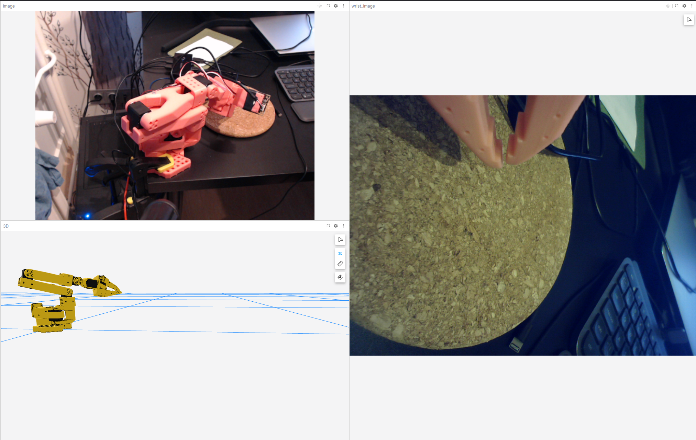

# LeRobot + Foxglove visualization

This directory contains a proof-of-concept visualization of LeRobot data using [Foxglove SDK](https://docs.foxglove.dev/docs/sdk/introduction).



The script `so_arm_100_foxglove_viewer.py` does the following:
* Read observations from SO-100 and fetches joint angles
* Using URDF, it calculates the TransformFrames
* Reads data from two cameras (at ID 0 and 4 by default)
* Publishes the TF and camera feeds so that it can be visualized in Foxglove

## Dependencies

The dependencies you will need to install for this to work:
* [LeRobot](https://github.com/huggingface/lerobot), make sure Feetech library is also installed
* [Foxglove-SDK](https://pypi.org/project/foxglove-sdk/)
* [URDFPY](https://pypi.org/project/urdfpy/)
* [numpy](https://pypi.org/project/numpy/)
* _Optional:_ [Node.js](https://nodejs.org/) if you wish to load your URDF over HTTP

> [!TIP]
> Foxglove can [load URDFs in several ways](https://docs.foxglove.dev/docs/visualization/panels/3d#add-urdf) including from a file path depending on your needs.

## Running the visualization script

To successfully run the visualization:
1. Run the robot calibration as you would with LeRobot
2. Find the ids of the cameras (if you have only one, comment the other one out in the code)
3. Set the variables ROBOT_NAME (need to be set to the name provided when calibration done), WRIST_CAM_ID and ENV_CAM_ID read by the LeRobot camera finding script.
4. Run the `so_arm_100_foxglove_viewer.py` script
5. Run a local server at the root of this repo if you'd like to display URDF in Foxglove:

```
npx http-server . -p 8000 --cors
```

Open the following url to make sure the urdf is served:

```
http://127.0.0.1:8000/SO100/so100.urdf
```

6. Go to [Foxglove](https://app.foxglove.dev/foxglovehq/view?ds=foxglove-websocket&ds.url=ws%3A%2F%2Flocalhost%3A8765), and open a local connection to `ws://localhost:8765`. Now your data should be flowing in!
7. [Import](https://docs.foxglove.dev/docs/visualization/layouts#import-and-export) our LeRobot layout from `foxglove/lerobot_layout.json`

## Recording data

If you wish to log data to [MCAP](https://mcap.dev/) recordings to replay and investigate later, uncomment the following lines and the Foxglove SDK will handle the rest:

```python
import datetime

now_str = datetime.datetime.now().strftime("%Y-%m-%d_%H-%M-%S")
file_name = f"so_arm_100_{now_str}.mcap"
foxglove.open_mcap(file_name)
```
