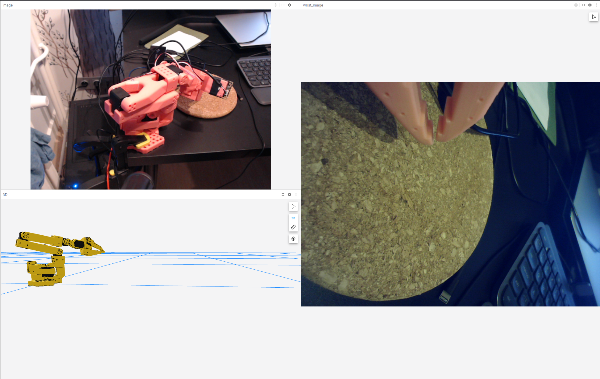

# LeRobot + Foxglove visualization

This directory contains a proof-of-concept visualization of LeRobot data using Foxglove SDK.



The script so_arm_100_foxglove_viewer.py does the following:
* Read observations from SO-100 and fetches joint angles
* Using URDF, it calculates the TransformFrames
* Reads data from two cameras (at ID 0 and 4 by default)
* Publishes the TF and camera feeds so that it can be visualized in Foxglove

## Dependencies

The dependencies you will need to install for this to work:
* [LeRobot](https://github.com/huggingface/lerobot), make sure Feetech library is also installed
* [Foxglove-SDK](https://pypi.org/project/foxglove-sdk/)
* [URDFPY](https://pypi.org/project/urdfpy/)
* numpy

## Running the visualization script

To successfully run the visualization, you will need to:
* Run the robot calibration as you would with LeRobot
* Find the ids of the cameras (if you have only one, comment the other one out in the code)
* Set the variables ROBOT_NAME (need to be set to the name provided when calibration done), WRIST_CAM_ID and ENV_CAM_ID read by the LeRobot camera finding script.
* Run a local server at the root of this repo if you'd like to display URDF in Foxglove:

```
npx http-server . -p 8000 --cors
```

Open the following url to make sure the urdf is served:

```
http://127.0.0.1:8000/SO100/so100.urdf
```

* Run Foxglove, and open a local connection to `ws://localhost:8765`. Now your data should be flowing in!
* Import our lerobot layout from `foxglove/lerobot_layout.json`


