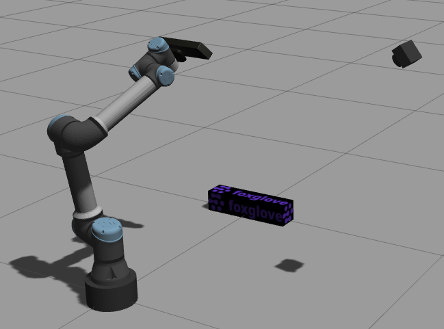

# ROS1 Gazebo simulation demo

Code reference for ROS 1 Gazebo simulation tutorial at https://foxglove.dev/blog/simulating-robotic-scenarios-with-ros1-and-gazebo.

This `catkin` package contains launch and URDF files to run an example [Gazebo](https://gazebosim.org/) simulation consisting of a robotic arm (UR5e) with a robot-mounted depth camera and a separate RGB camera.



## Building this package

To build this package, you will need an existing [ROS installation](http://wiki.ros.org/noetic/Installation).

1. Create a [catkin workspace](https://catkin-tools.readthedocs.io/en/latest/quick_start.html#initializing-a-new-workspace)
2. Clone this repository in the workspace's `src` folder
3. Install dependencies with `rosdep install -i --from-path src`
4. Build the package with `catkin build fg_gazebo_example`
5. Source the workspace

## Running the simulation

To run the simulation, simply launch the `simulation.launch` launch file:
```sh
roslaunch fg_gazebo_example simulation.launch
```

Refer to the [blog post](https://foxglove.dev/blog/simulating-robotic-scenarios-with-ros1-and-gazebo) for further information on how to move the simulated robot and how to set up Foxglove Studio to visualize sensor data.
