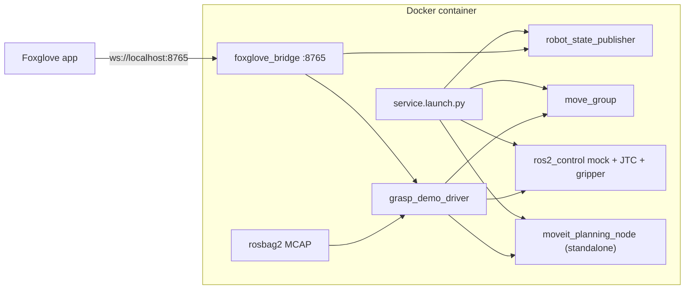

# Intrinsic MoveIt grasp planning in Foxglove

This tutorial runs [Intrinsic's open-source MoveIt grasp planner](https://github.com/intrinsic-ai/intrinsic-moveit) for the [Open Machine Tending Solution (OMTS)](https://github.com/intrinsic-ai/intrinsic-omts) cell and shows the result live in Foxglove. The cell is a UR5e, a Robotiq Hand-E, and an Orbbec Gemini 335Le wrist camera. Hardware is mocked with `ros2_control`, so the container needs no robot, GPU, or Intrinsic cluster.

The grasp generator is Intrinsic's MoveIt Task Constructor pipeline (`CurrentState`, open the hand, `Connect`, a `MoveRelative` approach, allow-collision, and `GenerateBoxGraspPoses` inside `ComputeIK`). It is served at `/grasp_planning/plan_grasps`. A small Python driver plays the role that Intrinsic's Flowstate `moveit_plan_grasp_skill` plays in the full stack: it ranks candidates, asks MoveIt for trajectories, and drives the mock arm through pick and place. Every cycle drops the billet at a new pose inside the OMTS return-shift window and plans again.

Upstream sources are pinned to [`c5e3290aa0f0e64c2d106a2fb4eb10cb52592205`](https://github.com/intrinsic-ai/intrinsic-moveit/commit/c5e3290aa0f0e64c2d106a2fb4eb10cb52592205) and compiled inside the image. They are not vendored into this repository.

## What comes from upstream

| Upstream path | In this demo |
| --- | --- |
| `robot_hardware_description` | Copied unmodified |
| `third_party/robot_hardware_moveit_config` | Copied unmodified |
| `moveit_planning_interfaces` (`PlanGrasps.srv`) | Copied unmodified |
| `grasp_planning_pipeline.cpp`, `generate_box_grasp_poses.cpp`, `object_geometry.cpp` and their headers | Compiled verbatim |
| `moveit_planning_service/launch/service.launch.py` | Installed and launched verbatim with mock hardware |
| `moveit_planning_node.cpp` | Replaced by an SDK-free standalone node with the same mock-mode services |
| Scene synchronizer, status monitor, Flowstate skills | Not built. They depend on the Intrinsic SDK |

`/motion_planning/get_motion_plan` on the planning node is an upstream stub: it returns success and an empty trajectory. Trajectories in this demo come from MoveIt's `/plan_kinematic_path`, which uses the same `moveit_msgs/srv/GetMotionPlan` type. `PlanGrasps` itself returns grasp poses and IK solutions, not trajectories.

## Architecture



## Requirements

- Docker with Compose v2
- About 8 GB of free disk. The built image is 3.1 GB
- Tested on x86_64. Jazzy publishes arm64 builds of these packages, but that path is untested
- [Foxglove](https://foxglove.dev) desktop or [app.foxglove.dev](https://app.foxglove.dev)

No display server or GPU is required. The container launches MoveIt with `headless:=true`.

The base image is pinned to `ros:jazzy-ros-base@sha256:c3706ef0a0aa45413c07803cf433602f543b22e45b4855f6fca955c2d8ecc4e8`. ROS apt packages are pinned to the Jazzy snapshot `2026-09-11` on `snapshots.ros.org` (build arg `ROS_APT_SNAPSHOT`), signed by the ROS snapshot key `4B63CF8FDE49746E98FA01DDAD19BAB3CBF125EA`, which expires 2027-06-01. Override the date with:

```bash
docker compose build --build-arg ROS_APT_SNAPSHOT=YYYY-MM-DD
```

The Ubuntu archive itself is not pinned. Versions from that snapshot:

| Package | Version observed in this image |
| --- | --- |
| `ros-jazzy-moveit-core` | 2.12.4-1noble.20260903.075716 |
| `ros-jazzy-moveit-ros-move-group` | 2.12.4-1noble.20260903.094420 |
| `ros-jazzy-moveit-planners-ompl` | 2.12.4-1noble.20260903.093406 |
| `ros-jazzy-pilz-industrial-motion-planner` | 2.12.4-1noble.20260903.100010 |
| `ros-jazzy-moveit-task-constructor-core` | 0.1.8-1noble.20260904.024044 |
| `ros-jazzy-foxglove-bridge` | 3.5.0-1noble.20260902.084741 |
| `ros-jazzy-rosbag2-storage-mcap` | 0.26.11-1noble.20260903.070458 |
| `ros-jazzy-ur-description` | 3.5.1-1noble.20260905.072414 |

The image installs the MoveIt libraries the launch file and standalone node link, not the `ros-jazzy-moveit` metapackage. `ur-description` is unpacked from its deb without installing the package, because that package depends on `rviz2`. The URDF's `find_package(rviz2)` is satisfied by an empty CMake config so RViz, Qt, and LLVM are not installed. Default CHOMP and STOMP pipeline files shipped by `moveit_configs_utils` are removed; joint transits use Pilz PTP and fall back to OMPL.

## Quick start

```bash
cd integrations/ros2/intrinsic_moveit
docker compose up --build
```

The first build downloads MoveIt and compiles the standalone planning node. Later starts reuse the image.

Then in Foxglove:

1. Open a connection, choose **Foxglove WebSocket**, and enter `ws://localhost:8765`.
2. Import [`foxglove_layouts/intrinsic_moveit_grasp_demo.json`](foxglove_layouts/intrinsic_moveit_grasp_demo.json).

Stop the stack with Ctrl-C or:

```bash
docker compose down
```

SIGINT lets rosbag2 finish the MCAP summary. Recordings land in `./recordings/`.

Headless checks (no Foxglove app):

```bash
docker compose exec intrinsic-moveit-demo python3 /opt/demo/scripts/check_foxglove_ws.py
docker compose exec intrinsic-moveit-demo python3 /opt/demo/scripts/check_plan_grasps.py
docker compose exec intrinsic-moveit-demo python3 /opt/demo/scripts/check_motion.py
```

## What you are seeing

The arm stands on a grey table. The shaded rectangle is the OMTS return-shift window (center `(0.45, 0)`, ±0.1 m, ±40°). An aluminium-colored `raw_stock_2x3x5` billet (`0.0762 x 0.127 x 0.0508` m, standing on its 3 inch edge) appears in that window.

| Phase | What happens |
| --- | --- |
| `SPAWN_WORKPIECE` | The billet is added to the MoveIt scene |
| `PLAN_GRASPS` | `/grasp_planning/plan_grasps` runs the MTC pipeline. The planner returns 10 IK variants of typically two distinct poses, and those poses are drawn on the billet |
| `SELECT_GRASP` | The closest feasible candidate turns green. The Raw Messages panel shows the `moveit_msgs/Grasp` |
| `OPEN_GRIPPER` | The Hand-E opens |
| `MOVE_TO_PREGRASP` | The driver picks the feasible IK solution closest to the current joints (each joint wrapped by `2π` into the UR limits) and plans a joint transit to it |
| `APPROACH` | A 10 cm Cartesian move along the tool to the grasp pose |
| `GRASP` | The fingers close to the billet width and the object is attached to `hande_tcp` |
| `RETREAT` | 10 cm back along the tool |
| `PLACE` | A translucent ghost shows the next pose in the return-shift window. The arm transits there |
| `PLACE_DESCEND` | Cartesian move down onto the ghost |
| `RELEASE` | The gripper opens and the billet is detached |
| `RETREAT_UP` | The tool backs off |
| `PARK` | The gripper closes and the arm returns to the work-facing home pose. The cycle counter increments |

Home is the SRDF `ready` pose with `shoulder_pan_joint` set to `-2.8173` instead of ready's `-0.1597`. That is a 2.658 rad (152°) turn, not π: enough to face the window, then back about 28° so `hande_tcp` is centred above it and points down. Joint transits (home, pre-grasp, and place) request Pilz PTP and fall back to OMPL if that pipeline rejects the goal.

The loop then plans a new grasp for the billet at its new pose. Feasible IK variants are ranked by weighted joint distance from the current arm, after wrapping each joint onto the equivalent angle closest to where it is now. `grasp_quality` only breaks ties. Variants that would flip `wrist_2` by more than π/2, or swing the base more than π/2 away from home, are dropped. Up to three distinct poses are tried if a pre-grasp motion fails. If none of Intrinsic's IK solutions pass, the driver calls `/compute_ik` on the pre-grasp pose seeded with the current joints.

The billet is 50.8 mm across the gripped face. `gripper_max_opening` is 0.052 m because the upstream open posture is `-0.001` m per finger on a 0.050 m nominal stroke (`opening = 0.050 - 2q`). The computed close command for this face is about `-0.0004` m, so the fingers move about 0.6 mm at the moment of grasp. The hand is opened before the approach and parked closed between cycles, and that open/close is the motion you see.

### Topics

| Topic | Type | Contents |
| --- | --- | --- |
| `/demo/scene_markers` | `visualization_msgs/MarkerArray` | Table, return-shift window, billet, place ghost |
| `/demo/grasp_candidates` | `visualization_msgs/MarkerArray` | Gripper glyphs, approach arrows, quality labels |
| `/demo/grasp_poses` | `geometry_msgs/PoseArray` | Every grasp pose, in the `raw_stock` frame |
| `/demo/pregrasp_poses` | `geometry_msgs/PoseArray` | Matching pre-grasp poses |
| `/demo/selected_grasp` | `geometry_msgs/PoseStamped` | Chosen grasp pose |
| `/demo/selected_grasp_msg` | `moveit_msgs/Grasp` | Raw message returned by Intrinsic's planner |
| `/demo/planned_tcp_path` | `nav_msgs/Path` | TCP samples of the last trajectory |
| `/demo/status` | `std_msgs/String` | Current phase |
| `/demo/cycle`, `/demo/failures` | `std_msgs/Int32` | Completed cycles and recoveries |
| `/demo/grasp_planning/num_candidates` | `std_msgs/Int32` | Candidates from the last `PlanGrasps` call |
| `/demo/grasp_planning/latency_s` | `std_msgs/Float64` | Wall time of that call |
| `/robot_description_web` | `std_msgs/String` | URDF with `package://` mesh URIs rewritten to the pinned GitHub commit |

Also published by the upstream launch: `/robot_description`, `/robot_description_semantic`, `/tf`, `/tf_static`, `/joint_states`, `/ur_manipulator_controller/controller_state`, and `/rosout`.

The layout's **Details** tab plots arm-joint feedback, the gripper joint (`/joint_states.position[1]`, `hande_left_finger_joint`), grasp-planning latency and candidate count, and the cycle and failure counters.

## Recordings

With `RECORD=true` (the default), rosbag2 writes an MCAP file under `./recordings/intrinsic_grasp_demo_<timestamp>/`. Open that file in Foxglove and import [`foxglove_layouts/intrinsic_moveit_grasp_demo_playback.json`](foxglove_layouts/intrinsic_moveit_grasp_demo_playback.json). It matches the live layout, except the **URDF (offline web)** layer (`/robot_description_web`) is on and the live `/robot_description` layer is off. Mesh URLs then load from `raw.githubusercontent.com` at the pinned commit, which sends `access-control-allow-origin: *`.

Live Foxglove sessions should import [`foxglove_layouts/intrinsic_moveit_grasp_demo.json`](foxglove_layouts/intrinsic_moveit_grasp_demo.json) and keep the `/robot_description` URDF layer enabled. The bridge fetches `package://` meshes itself. The Hand-E body DAE is about 12 MB, so the first load is slow.

## Call the grasp service yourself

```bash
docker compose exec -it intrinsic-moveit-demo bash
```

The interactive shell sources the workspace. The demo keeps a `raw_stock` collision object in the scene:

```bash
ros2 service call /grasp_planning/plan_grasps moveit_planning_interfaces/srv/PlanGrasps "{
  group_name: ur_manipulator,
  end_effector_group: hand,
  tool_frame: hande_tcp,
  planning_timeout_sec: 10.0,
  gripper_motion_duration_sec: 0.75,
  retract_dist_m: 0.1,
  surfaces: [0, 1, 2, 3, 4, 5],
  num_rotations: 4,
  target: {id: raw_stock}
}"
```

## Differences from the upstream deployment

- The image does not build the Intrinsic SDK, Flowstate bridge, Zenoh pubsub, or status monitor.
- Only mock hardware is supported. `use_mock_hardware:=false` logs a warning and still runs the mock path.
- World objects are inserted by the demo driver through `/apply_planning_scene`, not synchronized from Flowstate.
- Arm and Cartesian trajectories come from `move_group` (`/plan_kinematic_path`, `/compute_cartesian_path`, `/execute_trajectory`). The planning node's `/motion_planning/get_motion_plan` service is left as the upstream empty-trajectory stub.

## Configuration

| Control | Where | Default |
| --- | --- | --- |
| `RECORD` | container environment | `true` |
| `DEMO_CYCLES` | container environment | `0` (run until stopped). A positive value stops after that many cycles and leaves the bridge up |
| `INTRINSIC_MOVEIT_COMMIT` | Docker build arg | `c5e3290aa0f0e64c2d106a2fb4eb10cb52592205` |
| Scene, speeds, seed | `ros_ws/src/intrinsic_foxglove_demo/config/demo_params.yaml` | OMTS billet and return-shift window, seed `7` |

Example of a finite run:

```bash
DEMO_CYCLES=5 docker compose up
```

`DEMO_CYCLES` is read by `scripts/entrypoint.sh` and passed as the `cycles:=` launch argument. The seeded RNG makes place poses repeatable for a given seed.

To move the pin, set the build arg and rebuild:

```bash
docker compose build --build-arg INTRINSIC_MOVEIT_COMMIT=<git sha>
```

The standalone node only compiles the SDK-free sources. A commit that changes those files' APIs will need a matching driver update.

## Troubleshooting

- **Port 8765 is in use.** Stop the other process or change the host mapping in `compose.yaml`.
- **The robot has no meshes.** Wait for the first asset fetch (tens of megabytes). Confirm the bridge is the Foxglove WebSocket endpoint, not a raw rosbridge URL. The subprotocol is `foxglove.sdk.v1`.
- **Offline playback has no meshes.** Import [`foxglove_layouts/intrinsic_moveit_grasp_demo_playback.json`](foxglove_layouts/intrinsic_moveit_grasp_demo_playback.json). It enables the `/robot_description_web` URDF layer and hides the live `/robot_description` layer.
- **The arm pauses in `RECOVER`.** A sampled place pose was unreachable. The driver detaches, returns to the work-facing home pose, and samples a new billet pose. `/demo/failures` counts these events.
- **Logs.** `docker compose logs -f`.

## License

`intrinsic-moveit` is Apache-2.0. `robot_hardware_moveit_config` is BSD-3-Clause. The standalone `moveit_planning_node` is derived from Intrinsic's `moveit_planning_node.cpp` and keeps that file's Apache-2.0 header and the "derived from" notice.
