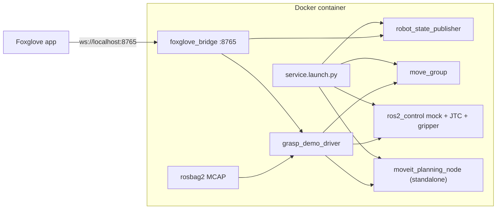

# Intrinsic MoveIt grasp planning in Foxglove

This tutorial runs [Intrinsic's open-source MoveIt grasp planner](https://github.com/intrinsic-ai/intrinsic-moveit) for the [Open Machine Tending Solution (OMTS)](https://github.com/intrinsic-ai/intrinsic-omts) cell and shows the result live in Foxglove. The cell is a UR5e, a Robotiq Hand-E, and an Orbbec Gemini 335Le wrist camera. Hardware is mocked with `ros2_control`, so the container needs no robot, GPU, or Intrinsic cluster.

The grasp generator is Intrinsic's MoveIt Task Constructor pipeline (`CurrentState`, open the hand, `Connect`, a `MoveRelative` approach, allow-collision, and `GenerateBoxGraspPoses` inside `ComputeIK`). It is served at `/grasp_planning/plan_grasps`. A small Python driver plays the role that Intrinsic's Flowstate `moveit_plan_grasp_skill` plays in the full stack: it ranks candidates, asks MoveIt for trajectories, and drives the mock arm through pick and place. Every cycle drops the billet at a new pose inside the OMTS return-shift window and plans again.

Upstream sources are pinned to [`c5e3290aa0f0e64c2d106a2fb4eb10cb52592205`](https://github.com/intrinsic-ai/intrinsic-moveit/commit/c5e3290aa0f0e64c2d106a2fb4eb10cb52592205) and compiled inside the image. They are not vendored into this repository.

## What comes from upstream

| Upstream path | In this demo |
| --- | --- |
| `robot_hardware_description` | Copied unmodified |
| `third_party/robot_hardware_moveit_config` | Copied unmodified |
| `moveit_planning_interfaces` (`PlanGrasps.srv`) | Copied unmodified |
| `grasp_planning_pipeline.cpp`, `generate_box_grasp_poses.cpp`, `object_geometry.cpp` and their headers | Compiled verbatim |
| `moveit_planning_service/launch/service.launch.py` | Installed and launched verbatim with mock hardware |
| `moveit_planning_node.cpp` | Replaced by an SDK-free standalone node with the same mock-mode services |
| Scene synchronizer, status monitor, Flowstate skills | Not built. They depend on the Intrinsic SDK |

`/motion_planning/get_motion_plan` on the planning node is an upstream stub: it returns success and an empty trajectory. Trajectories in this demo come from MoveIt's `/plan_kinematic_path`, which uses the same `moveit_msgs/srv/GetMotionPlan` type. `PlanGrasps` itself returns grasp poses and IK solutions, not trajectories.

## Architecture



## Requirements

- Docker with Compose v2
- About 6 GB of free disk (the image is about 3 GB)
- Tested on x86_64. Jazzy publishes arm64 builds of these packages, but that path is untested
- [Foxglove](https://foxglove.dev) desktop or [app.foxglove.dev](https://app.foxglove.dev)

No display server or GPU is required. The container launches MoveIt with `headless:=true`.

Packages used to build the image on Ubuntu Noble (versions float with the Jazzy apt snapshot; recorded September 2026):

| Package | Version observed in this image |
| --- | --- |
| `ros-jazzy-moveit` | 2.12.4-1noble.20260905.083030 |
| `ros-jazzy-moveit-task-constructor-core` | 0.1.8-1noble.20260904.024044 |
| `ros-jazzy-foxglove-bridge` | 3.5.0-1noble.20260902.084741 |
| `ros-jazzy-rosbag2-storage-mcap` | 0.26.11-1noble.20260903.070458 |
| `ros-jazzy-ur-description` | 3.5.1-1noble.20260905.072414 |

## Quick start

```bash
cd integrations/ros2/intrinsic_moveit
docker compose up --build
```

The first build downloads MoveIt and compiles the standalone planning node. Later starts reuse the image.

Then in Foxglove:

1. Open a connection, choose **Foxglove WebSocket**, and enter `ws://localhost:8765`.
2. Import [`foxglove_layouts/intrinsic_moveit_grasp_demo.json`](foxglove_layouts/intrinsic_moveit_grasp_demo.json).

Stop the stack with Ctrl-C or:

```bash
docker compose down
```

SIGINT lets rosbag2 finish the MCAP summary. Recordings land in `./recordings/`.

Headless checks (no Foxglove app):

```bash
docker compose exec intrinsic-moveit-demo python3 /opt/demo/scripts/check_foxglove_ws.py
docker compose exec intrinsic-moveit-demo python3 /opt/demo/scripts/check_plan_grasps.py
docker compose exec intrinsic-moveit-demo python3 /opt/demo/scripts/check_motion.py
```

## What you are seeing

The arm stands on a grey table. The shaded rectangle is the OMTS return-shift window (center `(0.45, 0)`, ±0.1 m, ±40°). An aluminium-colored `raw_stock_2x3x5` billet (`0.0762 x 0.127 x 0.0508` m, standing on its 3 inch edge) appears in that window.

| Phase | What happens |
| --- | --- |
| `SPAWN_WORKPIECE` | The billet is added to the MoveIt scene |
| `PLAN_GRASPS` | `/grasp_planning/plan_grasps` runs the MTC pipeline. Distinct candidates are drawn on the billet |
| `SELECT_GRASP` | The best feasible candidate turns green. The Raw Messages panel shows the `moveit_msgs/Grasp` |
| `OPEN_GRIPPER` | The Hand-E opens |
| `MOVE_TO_PREGRASP` | OMPL plans to Intrinsic's pre-grasp IK solution and the arm moves |
| `APPROACH` | A 10 cm Cartesian move along the tool to the grasp pose |
| `GRASP` | The fingers close to the billet width and the object is attached to `hande_tcp` |
| `RETREAT` | 10 cm back along the tool |
| `PLACE` | A translucent ghost shows the next pose in the return-shift window. The arm transits there |
| `PLACE_DESCEND` | Cartesian move down onto the ghost |
| `RELEASE` | The gripper opens and the billet is detached |
| `RETREAT_UP` | The tool backs off |
| `PARK` | The gripper closes and the arm returns to the SRDF `ready` pose. The cycle counter increments |

The loop then plans a new grasp for the billet at its new pose. Candidates are ranked by `grasp_quality` (highest first), with a more top-down approach winning ties. Up to three distinct poses are tried if a pre-grasp motion fails.

The billet is 50.8 mm across the gripped face and the Hand-E stroke is about 50 mm (`open = -0.001`, `closed = 0.025` on `hande_left_finger_joint`). The fingers barely move at the moment of grasp. The hand is opened before the approach and parked closed between cycles so the motion is visible.

### Topics

| Topic | Type | Contents |
| --- | --- | --- |
| `/demo/scene_markers` | `visualization_msgs/MarkerArray` | Table, return-shift window, billet, place ghost |
| `/demo/grasp_candidates` | `visualization_msgs/MarkerArray` | Gripper glyphs, approach arrows, quality labels |
| `/demo/grasp_poses` | `geometry_msgs/PoseArray` | Every grasp pose, in the `raw_stock` frame |
| `/demo/pregrasp_poses` | `geometry_msgs/PoseArray` | Matching pre-grasp poses |
| `/demo/selected_grasp` | `geometry_msgs/PoseStamped` | Chosen grasp pose |
| `/demo/selected_grasp_msg` | `moveit_msgs/Grasp` | Raw message returned by Intrinsic's planner |
| `/demo/planned_tcp_path` | `nav_msgs/Path` | TCP samples of the last trajectory |
| `/demo/status` | `std_msgs/String` | Current phase |
| `/demo/cycle`, `/demo/failures` | `std_msgs/Int32` | Completed cycles and recoveries |
| `/demo/grasp_planning/num_candidates` | `std_msgs/Int32` | Candidates from the last `PlanGrasps` call |
| `/demo/grasp_planning/latency_s` | `std_msgs/Float64` | Wall time of that call |
| `/robot_description_web` | `std_msgs/String` | URDF with `package://` mesh URIs rewritten to the pinned GitHub commit |

Also published by the upstream launch: `/robot_description`, `/robot_description_semantic`, `/tf`, `/tf_static`, `/joint_states`, `/ur_manipulator_controller/controller_state`, and `/rosout`.

The layout's **Details** tab plots commanded and actual arm joints from the joint trajectory controller, the gripper joint (`/joint_states.position[1]`, `hande_left_finger_joint`), and grasp-planning latency.

## Recordings

With `RECORD=true` (the default), rosbag2 writes an MCAP file under `./recordings/intrinsic_grasp_demo_<timestamp>/`. Open that file in Foxglove, import the same layout, and enable the **URDF (offline web)** layer (topic `/robot_description_web`) while hiding the live `/robot_description` layer. Mesh URLs then load from `raw.githubusercontent.com` at the pinned commit, which sends `access-control-allow-origin: *`.

Live Foxglove sessions should keep the `/robot_description` URDF layer enabled. The bridge fetches `package://` meshes itself. The Hand-E body DAE is about 12 MB, so the first load is slow.

## Call the grasp service yourself

```bash
docker compose exec -it intrinsic-moveit-demo bash
```

The interactive shell sources the workspace. The demo keeps a `raw_stock` collision object in the scene:

```bash
ros2 service call /grasp_planning/plan_grasps moveit_planning_interfaces/srv/PlanGrasps "{
  group_name: ur_manipulator,
  end_effector_group: hand,
  tool_frame: hande_tcp,
  planning_timeout_sec: 10.0,
  gripper_motion_duration_sec: 0.75,
  retract_dist_m: 0.1,
  surfaces: [0, 1, 2, 3, 4, 5],
  num_rotations: 4,
  target: {id: raw_stock}
}"
```

## Differences from the upstream deployment

- The image does not build the Intrinsic SDK, Flowstate bridge, Zenoh pubsub, or status monitor.
- Only mock hardware is supported. `use_mock_hardware:=false` logs a warning and still runs the mock path.
- World objects are inserted by the demo driver through `/apply_planning_scene`, not synchronized from Flowstate.
- Arm and Cartesian trajectories come from `move_group` (`/plan_kinematic_path`, `/compute_cartesian_path`, `/execute_trajectory`). The planning node's `/motion_planning/get_motion_plan` service is left as the upstream empty-trajectory stub.

## Configuration

| Control | Where | Default |
| --- | --- | --- |
| `RECORD` | container environment | `true` |
| `DEMO_CYCLES` | container environment | `0` (run until stopped). A positive value stops after that many cycles and leaves the bridge up |
| `INTRINSIC_MOVEIT_COMMIT` | Docker build arg | `c5e3290aa0f0e64c2d106a2fb4eb10cb52592205` |
| Scene, speeds, seed | `ros_ws/src/intrinsic_foxglove_demo/config/demo_params.yaml` | OMTS billet and return-shift window, seed `7` |

Example of a finite run:

```bash
DEMO_CYCLES=5 docker compose up
```

`DEMO_CYCLES` is read by `scripts/entrypoint.sh` and passed as the `cycles:=` launch argument. The seeded RNG makes place poses repeatable for a given seed.

To move the pin, set the build arg and rebuild:

```bash
docker compose build --build-arg INTRINSIC_MOVEIT_COMMIT=<git sha>
```

The standalone node only compiles the SDK-free sources. A commit that changes those files' APIs will need a matching driver update.

## Troubleshooting

- **Port 8765 is in use.** Stop the other process or change the host mapping in `compose.yaml`.
- **The robot has no meshes.** Wait for the first asset fetch (tens of megabytes). Confirm the bridge is the Foxglove WebSocket endpoint, not a raw rosbridge URL. The subprotocol is `foxglove.sdk.v1`.
- **Offline playback has no meshes.** Toggle the URDF layer to `/robot_description_web`.
- **The arm pauses in `RECOVER`.** A sampled place pose was unreachable. The driver detaches, returns to ready, and samples a new billet pose. `/demo/failures` counts these events.
- **Logs.** `docker compose logs -f`.

## License

`intrinsic-moveit` is Apache-2.0. `robot_hardware_moveit_config` is BSD-3-Clause. The standalone `moveit_planning_node` is derived from Intrinsic's `moveit_planning_node.cpp` and stays under Apache-2.0. The demo driver, launch file, and layout in this folder are Apache-2.0.
