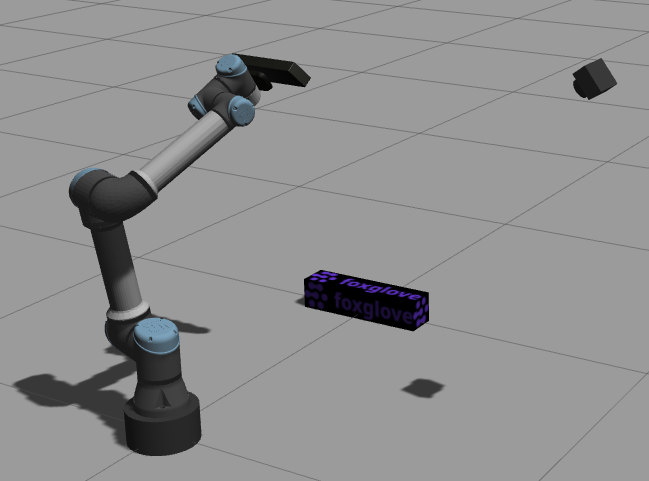

# ROS1 Gazebo simulation demo

Code reference for ROS 1 Gazebo simulation tutorial at https://foxglove.dev/blog/simulating-robotic-scenarios-with-gazebo-and-ros1.

This `catkin` package contains launch and URDF files to run an example [Gazebo](https://gazebosim.org/) simulation consisting of a robotic arm (UR5e) with a robot mounted depth camera and a separate RGB camera. [Foxglove Studio](https://foxglove.dev/docs/studio) is used to visualize the robot model and other sensor data such as depth & RGB images.



## Building this package

To build this package, you will need an existing [ROS installation](http://wiki.ros.org/noetic/Installation).

1. Create a [catkin workspace](https://catkin-tools.readthedocs.io/en/latest/quick_start.html#initializing-a-new-workspace)
2. Clone this repository in the workspace's `src` folder
3. Install dependencies with `rosdep install -i --from-path src`
4. Build the package with `catkin build fg_gazebo_example`
5. Source the workspace

## Running the simulation

To run the simulation, simply launch the `simulation.launch` launch file:
```sh
roslaunch fg_gazebo_example simulation.launch
```

This will start Gazebo and spawn the robot, the fixed camera and a box-shaped object in the Gazebo world. Additionally, [foxglove_bridge](https://index.ros.org/p/foxglove_bridge/#noetic) is launched which allows ROS topics such as the camera image topics to be visualized with Foxglove Studio.

## Run Foxglove Studio Desktop

To visualize the Robot and other sensor data, we will be using Foxglove Studio Desktop. If you do not have it already installed, you can download the latest version at https://foxglove.dev/download.

1. Launch Foxglove Studio
2. Make sure that the [ROS_PACKAGE_PATH](https://foxglove.dev/docs/studio/app-concepts/preferences#ros) includes your workspace. This is required for Studio to locate mesh files that are referenced in the Robot's URDF.
3. Open a new live connection using Foxglove Websocket and specify `ws://localhost:8765` as the connection URL
4. Add a 3D panel to visualize the Robot model and all transforms
5. Add several image panels to view the available RGB and depth image topics

## Moving the robot

To make the robot move consecutively to several positions, run the `move_viewpoints.py` script:
```sh
rosrun fg_gazebo_example move_viewpoints.py
```

If you want to move the robot to different positions, you can use [rqt_joint_trajectory_controller](http://wiki.ros.org/rqt_joint_trajectory_controller) or MoveIt's Motion planning Rviz plugin.
